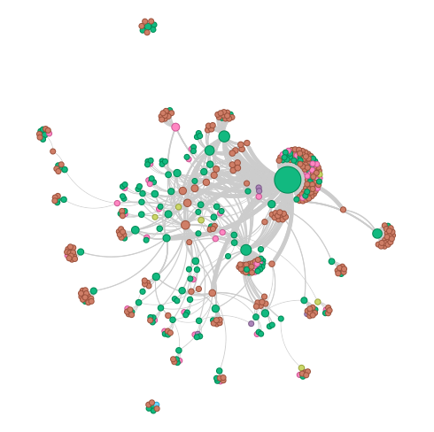

# BioHack 


## References

### Setup

I'm assuming you have set up a working environment with your triplestore and other systems you want.
Note this repo is using the UV package management system. (see: https://docs.astral.sh/uv/)

### Notebook prototype

Just playing with some established patterns to quickly load the graph. Used 
this notebook: [typeTypeView.ipynb](notebooks/typeTypeView.ipynb).  Eventually
you get to this type to type style network. 




### RDF load Quick start 

> NOTE: This is basically just the jsonldToTriple.ts redone into python.  ref: https://ai-docs.bio.xyz/developers/knowledge-graphs

First set up your triplestore, I'll use oxigraph, but later we can make this work for others too.  

So there is JSON-LD for the groups to start with at https://github.com/bio-xyz/BioAgents. Specifically

* https://github.com/bio-xyz/BioAgents/tree/main/sampleJsonLds
* https://github.com/bio-xyz/BioAgents/tree/main/sampleJsonLdsNew

Since this is at GitHub it's easy to convert a directory to a sitemap format pointing to the raw URLs.
We will use a tool from the [Gleaner.io Archetype repo](https://github.com/gleanerio/archetype). 

We can run these:

```bash
./scripts/github_jsonld_sitemap.py --output output/jld-sitemap.xml https://github.com/bio-xyz/BioAgents sampleJsonLds 
```

```bash
./scripts/github_jsonld_sitemap.py --output output/jldnew-sitemap.xml https://github.com/bio-xyz/BioAgents sampleJsonLdsNew 
```

To load out JSON-LD now, we can use the sitemap to pull the resources directly from GitHub.

```bash
./scripts/loadSitemapToTriplestore.sh ./output/jld-sitemap.xml http://homelab.lan:7878/store
```

and

```bash
`./scripts/loadSitemapToTriplestore.sh ./output/jldnew-sitemap.xml http://homelab.lan:7878/store
````


If you have been working and testing your triplestore, we can reset it to empty with:

> WARNING: use this with caution!

```bash
curl -i -X POST -H 'Content-Type: application/sparql-update' --data 'DROP ALL' http://homelab.lan:7878/update
```


### biohack.py notes

#### query mode

```bash
python biohack.py query --source http://homelab.lan:7878/query  --sink foo  --query ./sparql/getsubjects.rq --table bar
```

#### convert mode

The convert mode allows you to convert HTML or PDF documents to Markdown format. You can specify either a URL or a local file as the input source.

Convert an HTML document from a URL:
```bash
python biohack.py convert -url https://example.com -output output/example.md
```

Convert a local PDF file:
```bash
python biohack.py convert -local path/to/document.pdf -output output/document.md
```

This functionality uses html2text for HTML conversion and PyPDF2 for PDF conversion. Make sure to install the required dependencies:
```bash
pip install html2text PyPDF2
```


Also worked up a notebook ([typeTypeView.ipynb](notebooks/typeTypeView.ipynb)) to play around with search to visualization approaches.  

### BioAgent repo

https://github.com/bio-xyz/plugin-bioagent

### DKG (origin trail)


* https://docs.origintrail.io/build-with-dkg/quickstart-test-drive-the-dkg-in-5-mins


## Notes

* HTML to Markdown 
  *  crawl4ai: https://github.com/unclecode/crawl4ai 
* PDF to Markdown
    * https://github.com/microsoft/markitdown
    * https://github.com/docling-project/docling
* Then feed via BAML
