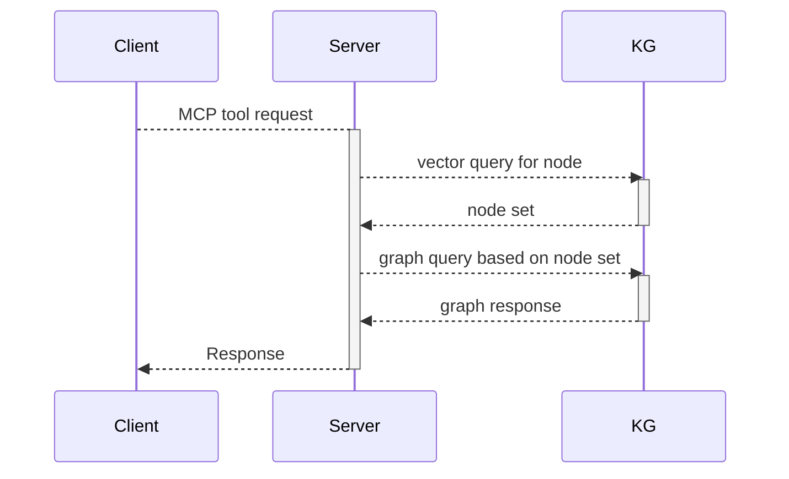

# MCP

## About 

Just a note to hold some ideas on integrating an MCP server 
over the KG formed from the assertions and entities.  

## Sequence Diagram

The initial plan for the MCP client server approach will leverage the 
vector search in KuzuDB.  So a query from a client will be used
to populate a vector search tool that will return a set of nodes.

Once that set of nodes is returned, they can be used as the frontier
set in a graph search that find other potential nodes or reinforces the
exiting nodes.

The results can then be sent to the client for display.

