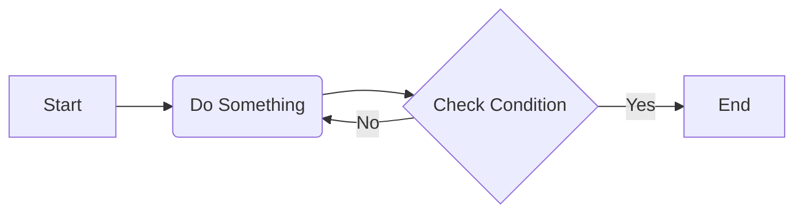
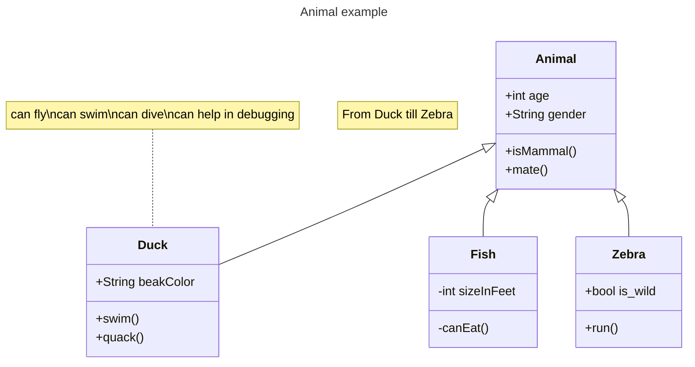

# Sprint 1 idea


references:
* https://ai-docs.bio.xyz/vision-and-mission/hackathon-ideas/full-projects/utilizing-knowledge-graphs-for-the-detection-of-potential-null-results
* https://grok.com/chat/33c0c7da-b139-410d-b0fc-e5b7a6dbb45b


```sparql
PREFIX rdf: <http://www.w3.org/1999/02/22-rdf-syntax-ns#>
PREFIX rdfs: <http://www.w3.org/2000/01/rdf-schema#>
SELECT DISTINCT ?sub
WHERE {
   ?sub ?pred ?obj .
    FILTER regex(str(?sub), "doi\\.org")
 }
```

* Collet the doi IRIs
* fetch them and convert to markdown (craw4ai for HTML and markitdown or others for PDF)
* make a vector index of chunks
* make a ER and  ER-link graph via Gliner and Relik

Follow the graph2solr pattern for run modes.

Here is my simple flowchart:





